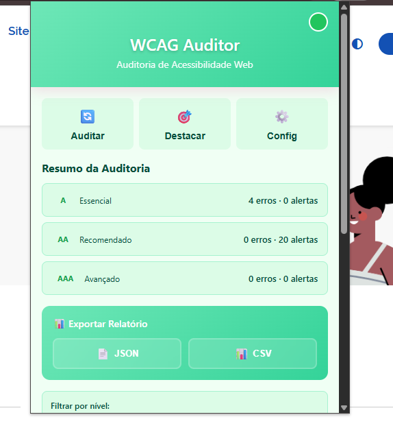
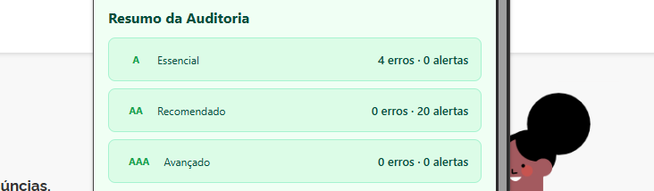
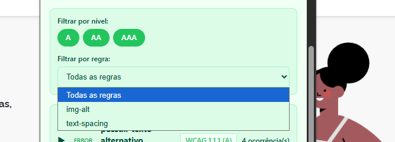
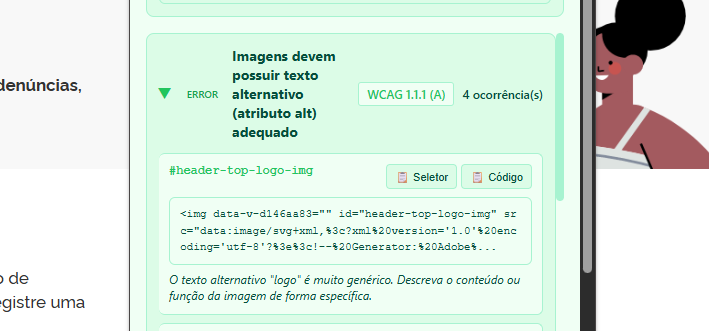
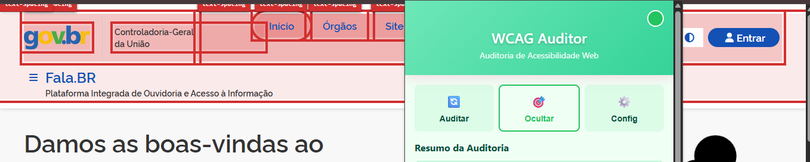
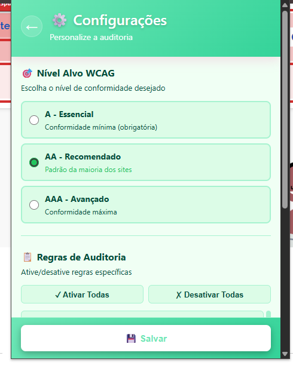
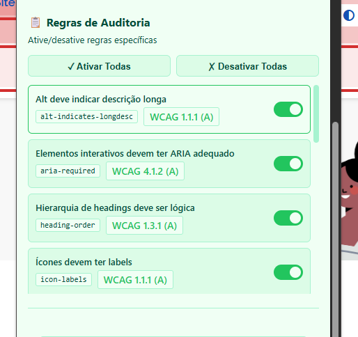

# 🔍 WCAG Auditor - Extensão Chrome

> **Auditoria automática de acessibilidade web baseada nas diretrizes WCAG 2.2**

Extensão Chrome que identifica violações de acessibilidade em tempo real, ajudando desenvolvedores e designers a criar sites mais inclusivos.

[](https://www.w3.org/WAI/WCAG22/quickref/)
[](https://developer.chrome.com/docs/extensions/)
[](LICENSE.md)

---

## 👥 Integrantes do Grupo 05

- **Euller Henrique** – Motor de auditoria, regras base (lote 0) e overlay de destaque
- **Ana Carolina** – UI/UX do popup, Options page e exportação de relatórios
- **Kauã Vinícius** – Regras avançadas (lotes 1–3), testes e validação

**Instituição:** Universidade de Brasília (UnB)  
**Disciplina:** Interação Humano-Computador (IHC) – 2025.2  
**Repositório:** [UnB-IHC/IHC-2025.2-Grupo05](https://github.com/UnB-IHC/IHC-2025.2-Grupo05)

---

## 📋 Sobre o Projeto

Esta extensão Chrome detecta **automaticamente** violações de acessibilidade em páginas web, seguindo as diretrizes **WCAG 2.2** (níveis A, AA e AAA).

### 🎯 Funcionalidades Implementadas

- ✅ **Auditoria automática** de páginas web via botão no popup
- ✅ **Resumo visual de resultados** (KPIs por nível A/AA/AAA)
- ✅ **Filtros por nível e regra** diretamente no popup
- ✅ **Identificação de violações WCAG** com severidade (erro/aviso)
- ✅ **Destaque visual** de elementos problemáticos (overlay acessível)
- ✅ **Navegação por teclado** entre elementos destacados
- ✅ **Exportação de resultados em JSON e CSV**
- ✅ **Options Page** para:
  - habilitar/desabilitar regras individualmente
  - definir **nível alvo** (A, AA, AAA)
- ✅ **14 regras implementadas** (níveis A, AA)
- 🚧 Lotes de regras avançadas (formulário, foco, contraste) em expansão

---

## 🚀 Como Instalar

### Pré-requisitos

- **Google Chrome** versão 88+ ou navegador baseado em Chromium (Edge, Brave, Opera)
- **Git** instalado (para clonar o repositório)

### Instalação em 2 Passos

#### 1 Clone o Repositório

```bash
git clone https://github.com/UnB-IHC/IHC-2025.2-Grupo05.git
cd IHC-2025.2-Grupo05
git checkout extensao
```

#### 2 Carregue no Chrome

1. Abra o Chrome e acesse: **`chrome://extensions/`**
2. Ative o **“Modo do desenvolvedor”** (toggle no canto superior direito)
3. Clique em **“Carregar sem compactação”**
4. Selecione a **pasta raiz do projeto** (`IHC-2025.2-Grupo05`)
5. ✅ A extensão aparecerá na lista com o nome **“WCAG Auditor”**
6. Fixe o ícone na barra de ferramentas (clique no ícone de quebra-cabeça → _pin_)

---

## 🔍 Como Auditar uma Página

### Passo a Passo

1. **Navegue até a página** que deseja auditar (qualquer site)
2. **Clique no ícone da extensão** (🔍) na barra de ferramentas
3. Clique no botão **“Auditar Página”**
4. Aguarde **1–3 segundos** enquanto a auditoria é executada
5. Visualize os resultados no popup:
   - 📊 **Resumo**: contadores de erros (vermelho) e avisos (laranja) por nível
   - 🎚️ **Filtros**: por nível (A/AA/AAA) e por regra específica
   - 📋 **Lista de violações**: agrupadas por regra, com detalhes
   - 🎯 **Destaque**: botão para destacar elementos na página

### Destaque Visual de Violações

Após auditar, clique em **“Destacar Violações”** para:

- ✨ Ver **outlines** ao redor dos elementos problemáticos
- 🏷️ Visualizar **badges** com o ID da regra violada
- 🎯 **Scroll automático** até o primeiro elemento
- ⌨️ **Navegar por teclado** (Tab) entre elementos destacados
- 🔄 Clicar novamente para **ocultar** os destaques

### Interpretando os Resultados

Cada violação mostra:

- **Regra WCAG**: critério e nível (ex: 1.1.1 – Nível A)
- **Descrição**: explicação clara do problema
- **Seletor CSS**: identificador do elemento na página
- **Snippet HTML**: trecho do código problemático
- **Dica de correção**: como resolver o problema

---

## 🧩 Interface do Popup e Options

### Popup – Visão Geral

A interface do popup é organizada em:

1. **Header** – título da extensão + subtítulo
2. **Ações principais** – botões:
   - **Auditar página**
   - **Destacar violações**
   - **Abrir configurações (Options)**
3. **Resumo (KPIs)** – cartões por nível WCAG:
   - A, AA, AAA com contagem de erros/alertas
4. **Filtros** – chips e selects:
   - por nível (A/AA/AAA)
   - por regra específica (`img-alt`, `link-name`, etc.)
5. **Lista de violações** – agrupadas por regra, com:
   - cabeçalho da regra (nome, WCAG, severidade, ocorrências)
   - lista de nós com seletor, snippet e botões de _copy_











### Options Page

A **Options Page** permite:

- Definir o **nível alvo**:
  - 🔹 Somente A
  - 🔹 A + AA
  - 🔹 A + AA + AAA
- Habilitar/desabilitar **regras individualmente** (lista com toggle)
- Restaurar configuração padrão (botão “Resetar configurações”)

Todas as preferências são salvas usando **`chrome.storage.sync`** (quando disponível), permitindo que o comportamento da auditoria respeite a configuração do usuário.

---

## 📊 Regras Implementadas

### ✅ 10 Regras – WCAG 2.2 (Níveis A e AA)

| #   | ID                       | Regra                      | WCAG   | Nível | O que Verifica                                       |
| --- | ------------------------ | -------------------------- | ------ | ----- | ---------------------------------------------------- |
| 1   | `page-title`             | Título da Página           | 2.4.2  | A     | `<title>` existe e não está vazio                    |
| 2   | `lang-html`              | Idioma da Página           | 3.1.1  | A     | `<html lang="...">` válido (ISO 639-1)               |
| 3   | `img-alt`                | Texto Alternativo          | 1.1.1  | A     | `` tem `alt` adequado (não vazio, não genérico) |
| 4   | `link-name`              | Links Descritivos          | 2.4.4  | A     | `<a>` tem texto descritivo (não “clique aqui”)       |
| 5   | `heading-order`          | Hierarquia de Cabeçalhos   | 1.3.1  | A     | H1→H2→H3 sem pular níveis                            |
| 6   | `multiple-ways`          | Múltiplas Formas Navegação | 2.4.5  | AA    | Menu, busca, sitemap (≥ 2 mecanismos)                |
| 7   | `text-spacing`           | Espaçamento Ajustável      | 1.4.12 | AA    | CSS não impede ajuste de espaçamento                 |
| 8   | `images-of-text`         | Evitar Imagens de Texto    | 1.4.5  | AA    | Detecta texto que deveria ser HTML/CSS               |
| 9   | `alt-indicates-longdesc` | Alt Indica Descrição       | 1.1.1  | A     | Alt menciona onde está descrição longa               |
| 10  | `icon-labels`            | Rótulos de Ícones          | 1.1.1  | A     | Ícones em botões/links têm rótulo claro              |

---

## 📋 Detalhes das Regras Base + Técnicas DOM

Abaixo, além da explicação funcional, estão as **técnicas de varredura DOM** usadas por cada regra, como exigido no enunciado.

---

### 1. `page-title` – Título da Página (WCAG 2.4.2)

**O que detecta:**

- ✗ Página sem `<title>`
- ✗ `<title>` vazio ou com menos de 3 caracteres

**Técnica DOM:**

- Seleção direta:

  ```javascript
  const title = document.querySelector("title");
  const text = title?.textContent.trim();
  if (!title || !text || text.length < 3) {
    // violação
  }
  ```

- Valida:
  - existência do elemento `<title>`
  - conteúdo não vazio
  - tamanho mínimo para evitar títulos inúteis

**Exemplo de violação:**

```html
<title></title>
<!-- ou -->
<title> </title>
```

**Como corrigir:**

```html
<title>Universidade de Brasília - Página Inicial</title>
```

---

### 2. `lang-html` – Idioma da Página (WCAG 3.1.1)

**O que detecta:**

- ✗ `<html>` sem atributo `lang`
- ✗ `lang` vazio ou inválido

**Técnica DOM:**

- Leitura de atributo na raiz:

  ```javascript
  const lang = document.documentElement.getAttribute("lang");
  const isValid = /^[a-z]{2,3}(-[a-z]{2,3})?$/i.test(lang || "");
  if (!lang || !isValid) {
    // violação
  }
  ```

- Valida:
  - existência do atributo `lang`
  - formato aproximado de códigos ISO 639-1/2 (ex: `pt-BR`, `en`, `es`)

**Exemplo de violação:**

```html
<html>
  <!-- ou -->
  <html lang="">
    <!-- ou -->
    <html lang="xyz"></html>
  </html>
</html>
```

**Como corrigir:**

```html
<html lang="pt-BR">
  <!-- Português brasileiro -->
</html>
<html lang="en">
  <!-- Inglês -->
</html>
<html lang="es">
  <!-- Espanhol -->
</html>
```

---

### 3. `img-alt` – Texto Alternativo (WCAG 1.1.1)

**O que detecta:**

- ✗ `` sem atributo `alt`
- ✗ `alt` vazio sem `role="presentation"`
- ✗ `alt` genérico (“imagem”, “foto”, nome do arquivo)
- ✗ `alt` muito longo (> 150 caracteres)

**Técnica DOM:**

- Varredura de todas as imagens:

  ```javascript
  document.querySelectorAll("img").forEach((img) => {
    const alt = img.getAttribute("alt");
    const role = img.getAttribute("role");
    const isDecorative = role === "presentation";

    // Heurísticas: ausência, vazio, muito longo, texto genérico etc.
  });
  ```

- Heurísticas:
  - `!alt && !isDecorative`
  - `alt.trim().length === 0 && !isDecorative`
  - `alt.match(/imagem|foto|image|banner|sem descrição/i)`
  - `alt.length > 150`

**Exemplo de violação:**

```html


```

**Como corrigir:**

```html


<!-- se decorativa -->

```

---

### 4. `link-name` – Nome de Link (WCAG 2.4.4)

**O que detecta:**

- ✗ `<a>` sem texto ou `aria-label`
- ✗ Texto muito curto (≤ 2 caracteres)
- ✗ Texto genérico (“clique aqui”, “saiba mais”, “aqui”)
- ✗ Texto é apenas a URL

**Técnica DOM:**

- Cálculo simples do **nome acessível**:

  ```javascript
  function getAccessibleName(link) {
    return (
      link.getAttribute("aria-labelledby") || // prioridade 1
      link.getAttribute("aria-label") || // prioridade 2
      link.textContent.trim() || // prioridade 3
      link.getAttribute("title") // prioridade 4
    );
  }

  document.querySelectorAll("a[href]").forEach((link) => {
    const name = getAccessibleName(link);
    // aplica heurísticas em cima de `name`
  });
  ```

- Heurísticas:
  - ausência de nome (`!name`)
  - nome muito curto (`name.length <= 2`)
  - termos genéricos: `"clique aqui"`, `"saiba mais"`, `"aqui"`
  - nome igual à própria URL (regex simples)

**Exemplo de violação:**

```html
<a href="/contato"></a>
<a href="/sobre">Clique aqui</a>
<a href="/docs">Saiba mais</a>
```

**Como corrigir:**

```html
<a href="/contato">Entre em contato conosco</a>
<a href="/sobre">Conheça a história da UnB</a>
<a href="/docs">Leia a documentação completa</a>
```

---

### 5. `heading-order` – Hierarquia de Cabeçalhos (WCAG 1.3.1)

**O que detecta:**

- ✗ Cabeçalhos que pulam níveis (ex: H1 → H3)
- ✗ Primeiro cabeçalho não é H1
- ✗ Hierarquia quebrada em qualquer ponto

**Técnica DOM:**

- Varredura sequencial:

  ```javascript
  const headings = Array.from(
    document.querySelectorAll("h1, h2, h3, h4, h5, h6")
  );

  let lastLevel = 0;
  headings.forEach((h) => {
    const level = Number(h.tagName.charAt(1));
    if (lastLevel && level > lastLevel + 1) {
      // violação: salto de nível
    }
    lastLevel = level;
  });
  ```

- Valida sequência H1 → H2 → H3 (sem saltos)

**Exemplo de violação:**

```html
<h1>Título Principal</h1>
<h3>Subseção</h3>
<!-- Pulou o H2! -->
```

**Como corrigir:**

```html
<h1>Título Principal</h1>
<h2>Seção</h2>
<h3>Subseção</h3>
<!-- Hierarquia correta -->
```

---

### 6. `multiple-ways` – Múltiplas Formas de Navegação (WCAG 2.4.5)

**O que detecta:**

- ⚠️ Página com menos de **dois mecanismos de navegação** detectados
- Verifica: menu, busca, breadcrumbs, sitemap, índice

**Técnica DOM:**

- Contagem heurística de mecanismos:

  ```javascript
  let mechanisms = 0;

  if (document.querySelector("nav, [role='navigation']")) mechanisms++;
  if (document.querySelector("form[role='search'], input[type='search']"))
    mechanisms++;
  if (document.querySelector("ol.breadcrumb, nav.breadcrumb")) mechanisms++;
  if (document.querySelector("a[href*='sitemap'], a[href*='mapa-do-site']"))
    mechanisms++;

  if (mechanisms < 2) {
    // violação (aviso)
  }
  ```

**Exemplo de violação:**

```html
<!-- Site com apenas menu, sem busca ou outros mecanismos -->
```

**Como corrigir:**

```html
<nav><!-- Menu principal --></nav>
<form role="search"><!-- Campo de busca --></form>
```

---

### 7. `text-spacing` – Espaçamento Ajustável (WCAG 1.4.12)

**O que detecta:**

- ⚠️ Elementos com `height` fixa que podem cortar texto
- ⚠️ `overflow: hidden` em textos longos
- ⚠️ `white-space: nowrap` impedindo quebra
- ⚠️ `line-height` muito baixa (< 1.2)

**Técnica DOM:**

- Leitura de estilos computados:

  ```javascript
  const candidates = document.querySelectorAll("p, span, li, a, div");

  candidates.forEach((el) => {
    const style = window.getComputedStyle(el);
    const lineHeight = parseFloat(style.lineHeight);
    const fontSize = parseFloat(style.fontSize);

    const ratio = lineHeight / fontSize;

    if (style.whiteSpace === "nowrap") {
      // possível problema
    }
    if (style.overflow === "hidden" && el.textContent.length > 80) {
      // possível corte de texto
    }
    if (!Number.isNaN(ratio) && ratio < 1.2) {
      // line-height muito baixo
    }
  });
  ```

**Exemplo de violação:**

```css
.box {
  height: 50px;
  overflow: hidden;
}
.text {
  white-space: nowrap;
}
```

**Como corrigir:**

```css
.box {
  min-height: 50px;
  overflow: visible;
}
.text {
  white-space: normal;
  line-height: 1.5;
}
```

---

### 8. `images-of-text` – Evitar Imagens de Texto (WCAG 1.4.5)

**O que detecta:**

- ⚠️ Imagens com nomes sugestivos (`title.png`, `heading-text.png`)
- ⚠️ `alt` que claramente descreve um título ou parágrafo
- ⚠️ SVGs com `<text>` interno usados como títulos

**Técnica DOM:**

- Heurísticas sobre `src` e `alt`:

  ```javascript
  document.querySelectorAll("img").forEach((img) => {
    const src = img.getAttribute("src") || "";
    const alt = (img.getAttribute("alt") || "").toLowerCase();

    const fileName = src.split("/").pop() || "";

    const looksLikeTitleImage = /title|titulo|heading|banner/i.test(fileName);
    const altLooksLikeTextBlock =
      alt.length > 0 && alt.length < 120 && /\s/.test(alt);

    if (looksLikeTitleImage || altLooksLikeTextBlock) {
      // possível imagem de texto
    }
  });
  ```

**Exemplo de violação:**

```html

```

**Como corrigir:**

```html
<h1>Bem-vindo ao nosso site</h1>
<!-- Texto real com CSS -->
```

---

### 9. `alt-indicates-longdesc` – Alt Indica Descrição (WCAG 1.1.1)

**O que detecta:**

- ⚠️ Imagem tem descrição longa mas o `alt` não indica
- ⚠️ `alt` menciona uma descrição (“veja descrição abaixo”) e ela não existe

**Técnica DOM:**

- Correlação entre `alt` e `aria-describedby`:

  ```javascript
  document.querySelectorAll("img[aria-describedby]").forEach((img) => {
    const alt = img.getAttribute("alt") || "";
    const descId = img.getAttribute("aria-describedby");
    const descEl = document.getElementById(descId);

    const mentionsDesc = /descrição|description|detalhes|detalhada/i.test(alt);

    if (descEl && !mentionsDesc) {
      // deveria indicar que há descrição longa
    }

    if (!descEl && mentionsDesc) {
      // alt diz que tem descrição, mas id não existe
    }
  });
  ```

**Exemplo de violação:**

```html

<div id="desc1"><!-- Descrição longa aqui --></div>
```

**Como corrigir:**

```html

<div id="desc1">O gráfico mostra vendas...</div>
```

---

### 10. `icon-labels` – Rótulos de Ícones (WCAG 1.1.1)

**O que detecta:**

- ✗ Links/botões com **apenas ícones** (Font Awesome, Material, SVG)
- ✗ Sem texto visível ou `aria-label`
- ✗ Rótulos muito genéricos

**Técnica DOM:**

- Detecta `<button>` ou `<a>` cujo conteúdo é só `<i>`, `<svg>` ou `<span>` “icônico”:

  ```javascript
  const clickable = document.querySelectorAll("button, a");

  clickable.forEach((el) => {
    const text = el.textContent.trim();
    const ariaLabel = el.getAttribute("aria-label");
    const hasIconOnly =
      el.children.length === 1 &&
      ["I", "SVG", "SPAN"].includes(el.children[0].tagName);

    if (hasIconOnly && !ariaLabel && text.length === 0) {
      // violação: ícone sem rótulo
    }
  });
  ```

**Exemplo de violação:**

```html
<a href="/home"><i class="fa fa-home"></i></a>
<button><span class="icon-search"></span></button>
```

**Como corrigir:**

```html
<a href="/home"><i class="fa fa-home"></i> Página Inicial</a>
<button aria-label="Buscar"><span class="icon-search"></span></button>
```

---

## 🛠️ Arquitetura Técnica

### Estrutura de Arquivos

```txt
/
├── manifest.json              # Configuração da extensão (MV3)
├── service-worker.js          # Background script (gerencia mensagens)
├── content.js                 # Content script (motor + overlay)
├── /src
│   ├── /core
│   │   ├── audit-runner.js    # Motor de auditoria (documentação)
│   │   ├── messaging.js       # Comunicação entre componentes
│   │   ├── contrast.js        # Cálculo de contraste de cores (lotes futuros)
│   │   └── SCHEMA.md          # Especificação do contrato de resultados
│   ├── /rules                 # Regras WCAG (uma por arquivo)
│   │   ├── README.md          # Guia de criação de regras
│   │   ├── TEMPLATE.js        # Template para novas regras
│   │   ├── page-title.js                  # ✅ Implementada
│   │   ├── lang-html.js                   # ✅ Implementada
│   │   ├── img-alt.js                     # ✅ Implementada
│   │   ├── link-name.js                   # ✅ Implementada
│   │   ├── heading-order.js               # ✅ Implementada
│   │   ├── multiple-ways.js               # ✅ Implementada
│   │   ├── text-spacing.js                # ✅ Implementada
│   │   ├── images-of-text.js              # ✅ Implementada
│   │   ├── alt-indicates-longdesc.js      # ✅ Implementada
│   │   └── icon-labels.js                 # ✅ Implementada
│   └── /ui
│       ├── popup.html         # Interface do popup
│       ├── popup.js           # Lógica do popup + highlight + filtros + export
│       └── popup.css          # Estilos do popup e options
└── /icons                     # Ícones da extensão (16, 48, 128px)
```

### Fluxo de Comunicação

```txt
┌──────────┐         ┌────────────────┐         ┌─────────────┐
│  Popup   │ ◄─────► │ Service Worker │ ◄─────► │   Content   │
│ (popup.js)│         │ (background)   │         │ (content.js)│
└──────────┘         └────────────────┘         └─────────────┘
     │                                                   │
     │ 1. requestAudit()                                 │
     │ ───────────────────────────────────────────────►  │
     │                                                   │
     │                                  2. runAudit()    │
     │                        ┌──────────────────────┐   │
     │                        │ AuditRunner.run()    │   │
     │                        │ - Executa regras     │   │
     │                        │ - Normaliza results  │   │
     │                        └──────────────────────┘   │
     │                                                   │
     │  ◄─────────────────────────────────────────────── │
     │ 3. { violations: [...] }                          │
     │                                                   │
     │ 4. displayResults()                               │
     │ 5. requestHighlight()                             │
     │ ───────────────────────────────────────────────► │
     │                                                   │
     │                        6. highlightNodes()        │
     │                           - Aplica CSS            │
     │                           - Scroll + focus        │
```

### Motor de Auditoria

O `AuditRunner` (em `audit-runner.js` / `content.js`) gerencia:

1. Registro de regras via `auditRunner.register(id, rule)`
2. Execução sequencial/assíncrona das regras habilitadas
3. Normalização dos resultados em um **schema único**:
   ```javascript
   {
     rule: 'img-alt',
     wcag: '1.1.1 (A)',
     level: 'A',
     severity: 'error',
     selector: 'img.logo',
     snippet: '',
     message: 'Imagens devem possuir texto alternativo...',
     helpUrl: 'https://www.w3.org/WAI/WCAG21/Understanding/1.1.1'
   }
   ```
4. Tratamento de erros por regra (uma regra com erro não derruba a auditoria inteira)

### Overlay de Destaque

O sistema de highlight (`highlightNodes()` no `content.js`) implementa:

- **Outline** ao redor dos elementos com violação
- **Badges** com ID da regra (ex. `img-alt`, `link-name`)
- **Scroll automático** até o primeiro resultado
- **Foco programático** para navegação via teclado
- Respeito a **`prefers-reduced-motion`** para usuários sensíveis a animações

---

## 🧪 Testes

```bash
# Executar testes unitários (quando implementado)
npm test

# Executar testes com coverage
npm run test:coverage
```

---

## 📦 Build e Distribuição

```bash
# Build para produção (quando implementado)
npm run build

# Gerar pacote .zip para Chrome Web Store
npm run package
```

---

## Contribuidores

## Integrantes

| Ana Elisa | Marina Galdi | Davi Camilo | Euller Junior | Kauã Vale |
|----------|--------------|-------------|---------------|-----------|
|  |  |  |  |  |

---

## 🤝 Contribuindo

Este projeto está em desenvolvimento ativo. Para contribuir:

1. Crie uma feature branch: `git checkout -b feature/nova-regra`
2. Implemente a funcionalidade seguindo conventional commits
3. Faça commit: `git commit -m 'feat(rules): add nova-regra (WCAG X.X.X)'`
4. Push: `git push origin feature/nova-regra`
5. Abra um Pull Request curto e focado

---

## 📄 Licença

Este projeto está sob a licença especificada em [LICENSE.md](LICENSE.md).

---

## 📞 Contato

Projeto desenvolvido como parte da disciplina de Interação Humano-Computador (IHC) – UnB 2025.2

---

**Status:** 🚧 Em desenvolvimento – Branch `extensao`
